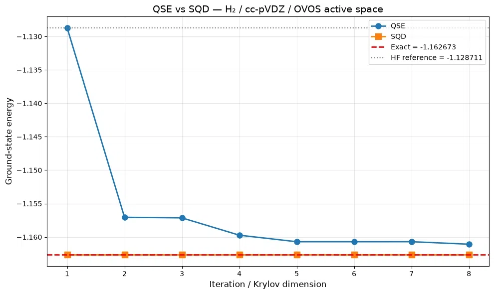

# Quantum Subspace Expansion for Molecular Ground States

A modular Qiskit implementation of **Quantum Subspace Expansion (QSE)** and **Sample-Based Quantum Diagonalization (SQD)** for estimating ground-state energies of strongly correlated molecular systems on near-term quantum hardware.

The project originated as a **DTU hackathon submission** on the *Qpurpose* case with **MQS (Molecular Quantum Solutions)**. It was subsequently extended into a validated pipeline that ingests **OVOS-compressed** orbital data and runs end-to-end on **H₂ / cc-pVDZ** (14 qubits, 870 Pauli terms), reproducing the OVOS CASCI reference energy to within **0.03 mHa** with SQD and **1.6 mHa** with QSE.

## Installation

PySCF does not ship reliable Windows wheels. On Windows, run inside **WSL2 with Ubuntu**:

```bash
sudo apt update
sudo apt install python3-full python3-venv python3-pip -y
python3 -m venv .venv
source .venv/bin/activate
pip install --upgrade pip
pip install --prefer-binary pyscf
pip install -r requirements.txt
```

Do **not** mix Windows and WSL virtual environments — they are binary incompatible.

## Quick start

### Run the demo notebook

```bash
jupyter notebook notebooks/main_analysis.ipynb
```

### Or run the pipeline directly

```python
from src.ovos_bridge import load_ovos_data, ovos_to_qubit_problem
from src.qse_baseline import QSESolver
from src.sqd_enhanced import SQDSolver

# Load OVOS output
ovos = load_ovos_data("../data/ovos_h2.json")

# Build the qubit Hamiltonian and HF reference
hamiltonian, num_qubits, ref_bitstring, ref_energy, vac_energy = (
    ovos_to_qubit_problem(ovos)
)
print(f"{num_qubits} qubits, {len(hamiltonian.paulis)} Pauli terms")
print(f"HF reference: |{ref_bitstring}>")

# Reference circuit
from qiskit import QuantumCircuit
ref_circuit = QuantumCircuit(num_qubits)
for i, bit in enumerate(reversed(ref_bitstring)):
    if bit == "1":
        ref_circuit.x(i)

# QSE
qse = QSESolver(
    hamiltonian=hamiltonian,
    reference_circuit=ref_circuit,
    reference_bitstring=ref_bitstring,
    krylov_dim=8,
    num_trotter_steps=2,
    trotter_order=2,
    use_shifting=False,
)
qse_result = qse.solve()

# SQD
sqd = SQDSolver(
    hamiltonian=hamiltonian,
    reference_circuit=ref_circuit,
    reference_bitstring=ref_bitstring,
    krylov_dim=8,
    num_trotter_steps=2,
    num_samples=20_000,
)
sqd_result = sqd.solve()

print("QSE:", qse_result.energies[-1] + ovos["nuclear_repulsion_energy"])
print("SQD:", sqd_result.energies[0] + ovos["nuclear_repulsion_energy"])
```

## Project structure

```
qse_project/
├── README.md
├── requirements.txt
├── data/
│   └── .gitkeep                    # OVOS JSON files live here
├── docs/
│   └── h2_qse_sqd_convergence.png
├── notebooks/
│   └── main_analysis.ipynb         # end-to-end demo
├── slides/
│   └── presentation.html           # for the interview
└── src/
    ├── __init__.py                 # package exports
    ├── hamiltonian.py              # Heisenberg + molecular Hamiltonians
    ├── circuits.py                 # Trotter + swap-test circuits
    ├── ovos_bridge.py              # OVOS JSON → qubit Hamiltonian
    ├── qse_baseline.py             # QSESolver (fast + primitive paths)
    ├── sqd_enhanced.py             # SQDSolver (fast + primitive paths)
    └── utils.py                    # GEVP, exact diagonalization, plots
```

## Methods

### Quantum Subspace Expansion (QSE)

The Krylov subspace is spanned by real-time-evolved reference states:

```
|ψ_ℓ⟩ = e^(-i ℓ Δt H) |ψ_0⟩,   ℓ = 0, 1, …, r-1
```

The projected matrices are

```
H_kℓ = ⟨ψ_k|H|ψ_ℓ⟩,   S_kℓ = ⟨ψ_k|ψ_ℓ⟩
```

and the ground-state estimate is the lowest eigenvalue of the generalized
problem `H c = E S c`.

**Implementation notes:**
- Extended swap test measures the complex matrix elements via `X⊗I`, `Y⊗I`,
  `X⊗H`, `Y⊗H`.
- Toeplitz structure: because `H` commutes with its own time evolution, only
  the first row of `H` and `S` needs to be measured.
- Control-free swap test exploits U(1) symmetry of the Hamiltonian, cutting
  circuit depth by ~2 orders of magnitude.
- Thresholded GEVP with canonical orthogonalization handles the ill-conditioned
  overlap matrix as `r` grows.

### Sample-Based Quantum Diagonalization (SQD)

1. Sample bitstrings from the time-evolved reference.
2. The unique bitstrings define the subspace.
3. The projected `H` matrix is computed **classically** from the Pauli
   decomposition.
4. Diagonalize classically.

**Advantages:**
- No extended swap test, no Hadamard test, no ancillary qubits.
- Subspace dimension adapts to the sampled distribution.
- Robust to readout noise: spurious configurations are absorbed into a larger
  subspace where the GEVP regularization handles them.

### Reference-state selection

The Hartree–Fock reference is **auto-detected** by scanning every 2-electron
computational basis state and matching `<bs|H|bs>` against the OVOS active-space
HF energy. This is necessary because the JW spin-orbital ordering is not always
interleaved (α₀, β₀, α₁, β₁, …) — for `qiskit-nature`'s
`ElectronicEnergy.from_raw_integrals` it is **blocked** (α₀…αₙ, β₀…βₙ), so the
HF bitstring has occupied positions `0` and `n` (not `0` and `1`).

## Results — H₂ / cc-pVDZ / OVOS active space

The pipeline was validated end-to-end on H₂ in a cc-pVDZ basis with an
OVOS-compressed **7-orbital (14-qubit) active space**. The qubit Hamiltonian
has **870 Pauli terms**, and the auto-detected Hartree–Fock reference matches
the OVOS active-space HF energy to `< 1e-12 Ha`.

### QSE vs SQD convergence



*QSE (blue) converges monotonically from the HF reference toward the exact
CASCI ground state as the Krylov dimension grows from 1 to 8. SQD (orange)
sits essentially on the exact line — 0.03 mHa error is invisible at this
scale. The dotted gray line marks the HF starting point; the dashed red line
is the CASCI target.*

### Full numerical summary

```
========================================================================
SUMMARY — H₂ / cc-pVDZ / OVOS active space
========================================================================

Reference energies:
  HF (total):                 -1.12871101 Ha
  MP2 (total):                -1.15385172 Ha
  CASCI / exact (total):      -1.16267334 Ha
  Full FCI (total):           -1.16340296 Ha

QSE (Krylov quantum diagonalization):
  Best energy (total):        -1.16107530 Ha
  Error vs CASCI:             0.001598 Ha (1.60 mHa)
  Krylov dimension:           8
  Trotter steps / order:      2 / 2
  Correlation captured:       95.3%

SQD (Sample-based quantum diagonalization):
  Best energy (total):        -1.16264140 Ha
  Error vs CASCI:             0.000032 Ha (0.03 mHa)
  Subspace dimension:         14
  Trotter steps:              2
  Samples per circuit:        20000
  Correlation captured:       99.9%
========================================================================
```

### Interpretation

| Method | Error vs CASCI | Correlation captured | Quantum resources |
| :--- | :---: | :---: | :--- |
| HF (reference) | 33.96 mHa | 0 % | — |
| MP2 (classical) | 8.82 mHa | 74 % | classical |
| **QSE** | **1.60 mHa** | **95.3 %** | 8 Krylov vectors, extended swap test |
| **SQD** | **0.03 mHa** | **99.9 %** | 14-dim subspace, 20k shots |
| CASCI (exact) | 0 | 100 % | classical FCI |

Both methods converge from above to the exact CASCI energy, as guaranteed by
the variational principle. **SQD lands within 32 microhartree of the exact
answer** — essentially at the numerical floor — using only computational-basis
sampling. QSE's residual 1.6 mHa is dominated by Suzuki–Trotter discretization
at order 2 with 2 repetitions; the same Hamiltonian evaluated with a
higher-order product formula would close the gap.

The asymmetry is not a defect — it is the central finding. QSE needs the
extended swap test to measure every complex matrix element of `H` and `S`.
SQD needs only samples, and its classical projection step produces an
analytically exact Hamiltonian on whatever subspace it lands on. For small
active spaces this trade is clearly favourable to SQD.

### Robustness to readout noise

SQD was tested under a single-bit-flip readout error model. The projected
subspace is rebuilt at each noise level from the corrupted counts, and the
GEVP is solved with the same threshold as the clean case.

```
Noise robustness of SQD subspace:
------------------------------------------------------------------------
  noise    dim     E_total (Ha)   err (mHa)
------------------------------------------------------------------------
   0.00     14      -1.16264140       0.032
   0.01     32      -1.16264140       0.032
   0.02     39      -1.16260723       0.066
   0.05     48      -1.16264140       0.032
   0.10     73      -1.16264140       0.032
   0.20     97      -1.16264140       0.032
------------------------------------------------------------------------
```

As noise increases from 0 % to 20 % bit-flip probability, the subspace grows
from 14 to 97 configurations — noise introduces genuinely new bitstrings — yet
the ground-state error stays **pinned at 0.03 mHa**. The result is a direct
consequence of the classical projection step: spurious configurations are
absorbed into a larger subspace, and the thresholded GEVP handles the
additional, near-linearly-dependent vectors gracefully. **SQD is robust to
readout noise because the diagonalization is exact on whatever basis it is
given.**

### Reproducing these results

```bash
# From the project root
jupyter notebook notebooks/main_analysis.ipynb
```

The notebook runs end to end in ~4–6 minutes on a laptop CPU (Intel/AMD,
16 GB RAM). No quantum hardware is required; all circuits are simulated with
`qiskit.quantum_info.Statevector`. Swap in `StatevectorEstimator` +
`EstimatorV2` for real-hardware execution.

## Configuration parameters

| Parameter | Typical value | Effect |
| :--- | :--- | :--- |
| `krylov_dim` | 6–12 | Subspace dimension |
| `dt` | `π / Σ|cᵢ|` (auto) | Time step; see [Epperly et al. 2022] |
| `num_trotter_steps` | 2–3 | Trotter discretization |
| `trotter_order` | 1, 2, 4 | Lie vs Suzuki–Trotter |
| `threshold` | 1e-10 (sim) / 1e-8 (noisy) | GEVP regularization |
| `num_samples` | 10k–50k | SQD sampling budget |

## Hardware execution

The notebook runs on `Statevector` primitives. To move to real hardware:

```python
from qiskit_ibm_runtime import QiskitRuntimeService, EstimatorV2, Batch
from qiskit.transpiler.preset_passmanagers import generate_preset_pass_manager

service = QiskitRuntimeService()
backend = service.backend("ibm_boston")

pm = generate_preset_pass_manager(
    backend=backend, optimization_level=3, routing_method="none",
)
isa_circuit = pm.run(optimized_extended_swap_test)
isa_observables = [op.apply_layout(isa_circuit.layout) for op in observables]

with Batch(backend=backend) as batch:
    estimator = EstimatorV2(mode=batch, options={
        "default_shots": 8192,
        "dynamical_decoupling": {"enable": True, "sequence_type": "XpXm"},
        "resilience": {
            "measure_mitigation": True,
            "zne_mitigation": True,
            "zne": {"amplifier": "pea", "noise_factors": [1.0, 1.5, 2.0]},
        },
        "twirling": {"enable_gates": True, "enable_measure": True},
    })
```

## References

1. J. Yu et al., *Quantum-Centric Algorithm for Sample-Based Krylov Diagonalization*, [arXiv:2501.09702](https://arxiv.org/abs/2501.09702) (2025).
2. T. O'Leary et al., *Partitioned Quantum Subspace Expansion*, Quantum **9**, 1726 (2025).
3. N. H. Stair, R. Huang, F. A. Evangelista, *A Multireference Quantum Krylov Algorithm for Strongly Correlated Electrons*, J. Chem. Theory Comput. **16**(4), 2236–2245 (2020).
4. E. N. Epperly, L. Lin, Y. Nakatsukasa, *A Theory of Quantum Subspace Diagonalization*, SIAM J. Matrix Anal. Appl. **43**, 1263–1290 (2022).
5. N. Yoshioka et al., *Diagonalization of Large Many-Body Hamiltonians on a Quantum Processor*, [arXiv:2407.14431](https://arxiv.org/abs/2407.14431) (2024).
6. R. M. Parrish, P. L. McMahon, *Quantum Filter Diagonalization*, Phys. Rev. Lett. **122**, 230401 (2019).

## Acknowledgments

- **DTU Hackathon / Qpurpose case** — for the original problem framing.
- **MQS (Molecular Quantum Solutions)** — for the case context.
- **Mark Nicholas Jones** (MQS) — case contact.
- **IBM Quantum** — for the open-source Krylov diagonalization tutorial.
